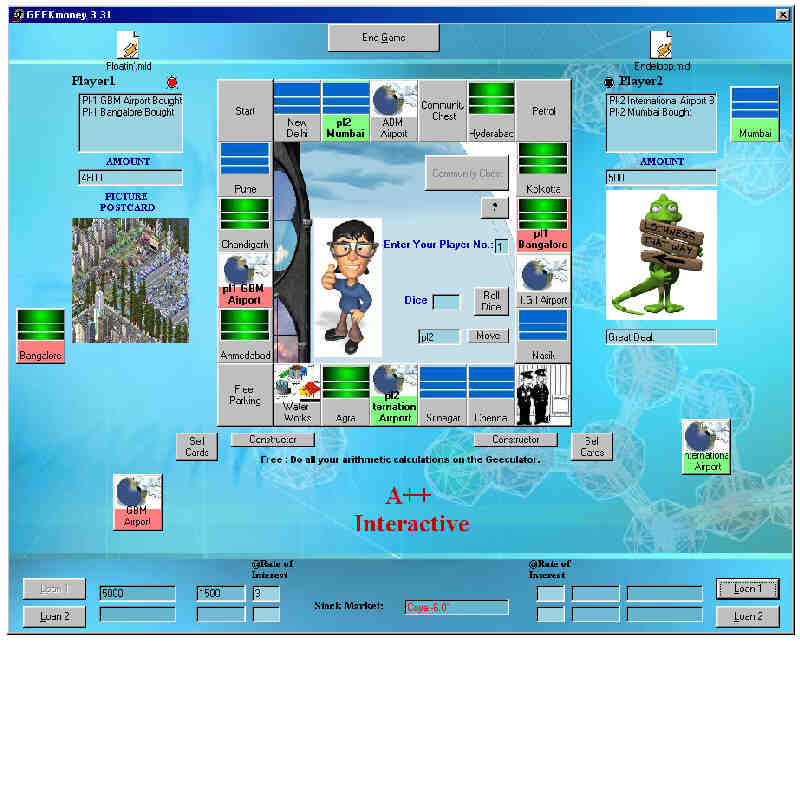



## GEEKmoney 3\.1\.1

### Description

This is based on the famous Board Game "MONOPOLY".I have even introduced systems of LOANS,and many more.But it is not the last and an improved version of the same is being developed.
 
### More Info
 
Form1 and Form2

The game is a 2 player game with the assumption that 2 players are playing as if they are playing on a board,that is they have to keep a check of their moves.

---

             |
---                |---
**Submitted On**   |2004-12-30 19:01:32
**By**             |[Aman M](https://github.com/Planet-Source-Code/PSCIndex/blob/master/ByAuthor/aman-m.md)
**Level**          |Intermediate
**User Rating**    |5.0 (15 globes from 3 users)
**Compatibility**  |VB 5\.0
**Category**       |[Games](https://github.com/Planet-Source-Code/PSCIndex/blob/master/ByCategory/games__1-38.md)
**World**          |[Visual Basic](https://github.com/Planet-Source-Code/PSCIndex/blob/master/ByWorld/visual-basic.md)
**Archive File**   |[GEEKmoney\_18347412312004\.zip](https://github.com/Planet-Source-Code/aman-m-geekmoney-3-1-1__1-57854/archive/master.zip)

